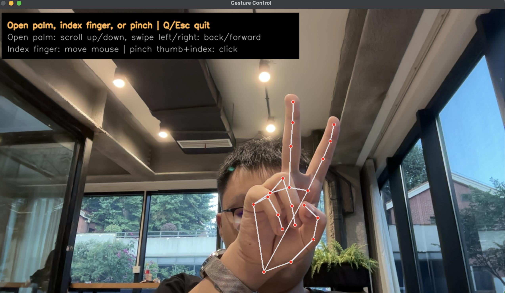

# Gesture Control

<p align="center">
  
</p>

用电脑内置摄像头识别手势，控制滚动、鼠标移动、点击和页面前进/后退。

## 安装

```bash
cd gesturepro
python3 -m venv .venv
source .venv/bin/activate
pip install -r requirements.txt
```

首次运行会自动下载 MediaPipe 手部识别模型（约 3 MB）到 `models/` 目录。

## 运行

```bash
python gesture_scroll.py
```

查看可用摄像头：

```bash
python gesture_scroll.py --list-cameras
```

在这台 Mac 上，OpenCV 的 `--camera 0` 是手机连续互通摄像头，`--camera 1` 对应电脑内置 FaceTime HD Camera。

## 手势

打开任意网页或文档，把一只手对着摄像头：

| 手势 | 动作 |
|------|------|
| 张开手掌上下滑 | 页面滚动 |
| 张开手掌左右滑 | 浏览器后退 / 前进 |
| 只伸食指 | 移动鼠标 |
| 拇指食指快速捏合 | 单击 |
| 拇指食指捏住不放 | 拖拽，松开后放下 |
| 食指 + 中指 | 右键 |
| 食指 + 中指 + 无名指 | 双击 |
| 握拳 | 暂停 / 恢复手势控制 |
| Q / Esc | 退出 |

## macOS 权限

第一次运行时，系统可能需要授权：

- **摄像头**：允许 Terminal、iTerm、VS Code 或 Cursor 使用摄像头
- **辅助功能**：允许 Python 或终端控制电脑（滚动、鼠标）

路径：`系统设置 -> 隐私与安全性 -> 摄像头 / 辅助功能`

## 调参

如果还是卡：

```bash
python gesture_scroll.py --model-quality fast
```

光标精度不够：

```bash
python gesture_scroll.py --model-quality accurate --landmark-alpha 0.55 --smooth-alpha 0.45
```

光标太飘：

```bash
python gesture_scroll.py --smooth-alpha 0.35 --landmark-alpha 0.5
```

滚动太敏感：

```bash
python gesture_scroll.py --threshold 0.12 --cooldown 0.35
```

反应太慢：

```bash
python gesture_scroll.py --threshold 0.06 --frames 5
```

## 交互逻辑（v5）

采用 **模式状态机**，不同操作互不干扰：

| 模式 | 进入 | 操作 |
|------|------|------|
| **POINTER**（默认） | 伸出手 | 食指移动光标，捏合点击/拖拽 |
| **SCROLL** | 张掌稳定 5 帧 | 上下滑滚动，左右滑前进/后退；收掌退出 |
| **PINCH / DRAG** | 拇指食指捏合 | 松开=单击，按住=拖拽 |
| **PAUSED** | 握拳 0.6s | 全部暂停；再握拳恢复 |

**设计原则：**
- 滚动与移动光标 **互斥**，不会同时触发
- 右键/双击 **边沿触发**（做一次手势触发一次），不会连发
- 离散操作后有 0.35s 冷却，避免误触
- 界面边框颜色 = 当前模式，顶部显示模式名和提示

```
gesturepro/
├── gesture_scroll.py   # 主程序
├── interaction.py      # 交互状态机 ← 新
├── gestures.py         # 手势识别
└── controller.py       # 鼠标/键盘
```

## 升级说明（v4 — 精准识别++）

- **手掌坐标系归一化**：手指判断不再受手倾斜/旋转影响
- **世界坐标 3D 分析**：利用 MediaPipe 3D 关键点计算关节角度
- **模板匹配评分**：所有手势同时打分，仅当领先第二名足够多时才输出
- **手指分数时序平滑**：连续帧 EMA，消除单帧跳变
- **追踪迟滞**：已锁定手势需更强证据才切换
- **画面质量门控**：手太小/出框/侧向时降低置信度或拒绝识别
- **捏合质量分**：综合距离 + 拇指角度 + 伸展度，3 帧确认
- 指尖颜色反映伸展度（越绿越伸直），右上角 **Q%** 为画面质量
- 精准模式推理分辨率 **960px**

```bash
python gesture_scroll.py --cpu-only
```
